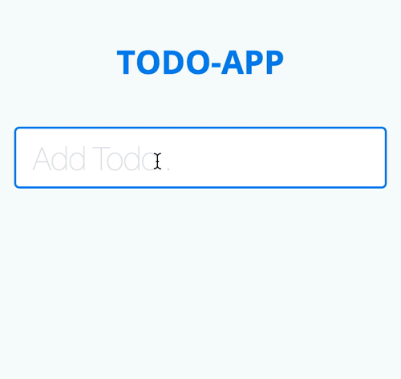

# Simple Todo-App with Angular2



This is a very basic example of a Todo application with Angular2 (Beta). It demonstrates features like:

- handling events (`keyup`)
- repeating elements with ngFor (`todo-item`)
- seperate components (`todo-item`) and share data with them with @Input

### Getting started
The projects dependencies (i.e. Angular2) are loaded with the package manager [npm](https://www.npmjs.com) and a local server-environment is set up by [gulp](http://gulpjs.com) and [browser-sync](http://browsersync.io). So after you've installed node.js, npm and gulp on your computer you can easily build and start the thing by executing:

```
npm install
gulp
```
